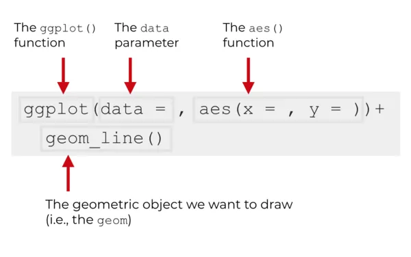
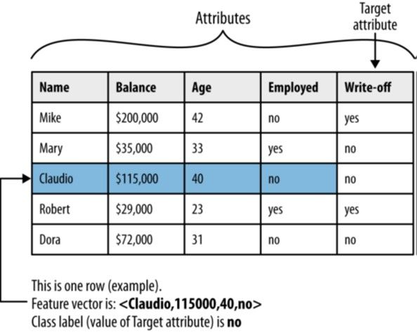
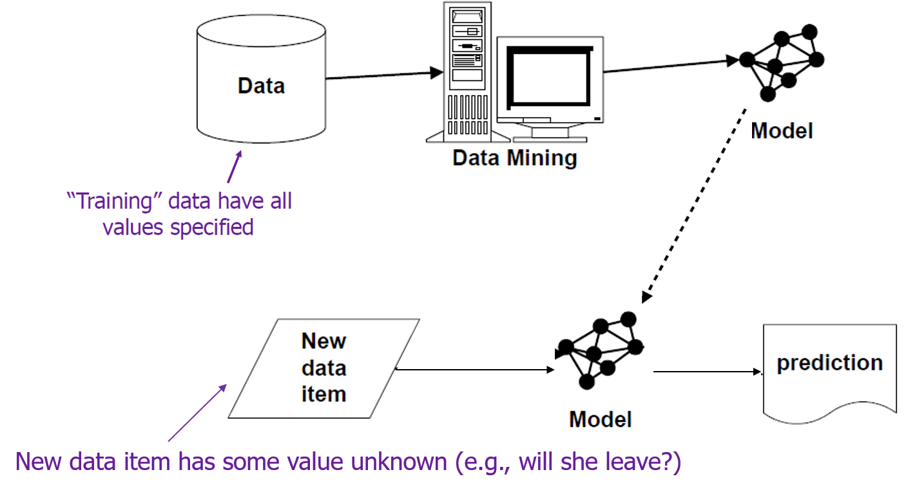
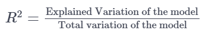
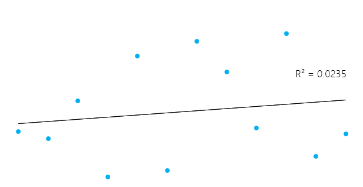
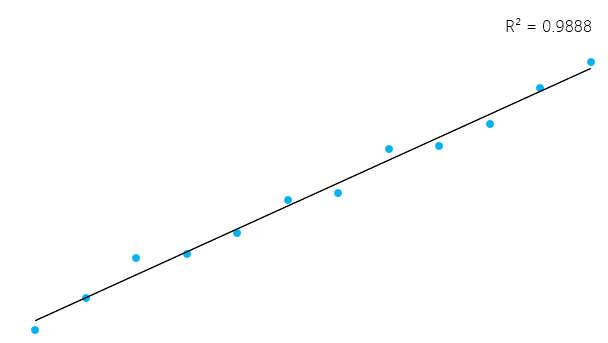

```{=html}
<style type="text/css">

body{ /* Normal  */
      font-size: 24px;
  }
td {  /* Table  */
  font-size: 8px;
}
h1.title {
  font-size: 38px;
  color: DarkRed;
}
h1 { /* Header 1 */
  font-size: 28px;
  color: DarkBlue;
}
h2 { /* Header 2 */
    font-size: 22px;
  color: DarkBlue;
}
h3 { /* Header 3 */
  font-size: 22px;
  font-family: "Times New Roman", Times, serif;
  color: DarkBlue;
}
code.r{ /* Code block */
    font-size: 20px;
}
pre { /* Code block - determines code spacing between lines */
    font-size: 20px;
    overflow-x: auto;
}
pre code {
  word-wrap: normal;
  white-space: pre;
}
</style>
```

------------------------------------------------------------------------

```{r global_options, echo = FALSE, include = FALSE}
options(width = 999)
knitr::opts_chunk$set(echo = TRUE, warning = FALSE, message = FALSE, cache = FALSE, tidy = FALSE, size = "small")
```

# Exploratory data analysis

**Learning Objectives**

-   Why data Visualization?

-   Practice using different types of plots.

-   Use R methods for plotting.

-   Create line plots, bar plots, histograms, and box plots.

-   Introduction to ggplot2

    {width="1000" height="10"}

### **Let's review the data science lifecycle**


**Data Science is an iterative process**


{width="1000" height="10"}

### Why Use Data Visualization?

Because of the way the human brain processes information, charts or graphs that visualize large amounts of complex data are easier to understand than spreadsheets or reports.

Data visualization is a quick, easy way to convey concepts in a universal manner --- and you can experiment with different scenarios by making slight adjustments.

### **Choosing the right type of visualization**

The choice of visualization should depend what you are trying to show. Here is a helpful flowchart that you can use to determine the best type of visualizations.

\

### **The Importance of visualization**

-   Given the same data, different visualization styles can convey different messages

-   Examples here:

    -   <https://medium.economist.com/mistakes-weve-drawn-a-few-8cdd8a42d368>

{width="1000" height="10"}

# **Load in data sets for visualization examples.**

The Boston data dictionary can be found [here](https://archive.ics.uci.edu/ml/machine-learning-databases/housing/housing.names).

```{r}
# Read in the Boston housing data.
housing_csv = 'data/boston_housing_data.csv'
housing = read.csv(housing_csv)

# Read in the drinks data.
drink_cols = c('country', 'beer', 'spirit', 'wine', 'liters', 'continent')
url = 'data/drinks.csv'
drinks = read.csv(url, header=TRUE, col.names=drink_cols)

# Read in the ufo data.
ufo = read.csv('data/ufo.csv')
head(ufo)
```

Let's work with the date feature:

```{r}
#create Year attribute
library(lubridate) 
ufo$Time = as.Date(ufo$Time,format='%m/%d/%Y')
ufo$Year = year(ufo$Time)
```

### **Understand each dataset well before we try to visualize the data**

```{r}
head(housing)
```

```{r}
head(drinks)
```

```{r}
head(ufo)
```

# Plotting

## Counting operation

To count observations that meet some criterion, you can nest a logical expression in a call to the sum function

The table function can be used for counts for all combinations of factor levels

```{r}
year_count <- table(ufo$Year)
year_count
```

```{r}
sorted_year_count <- sort(year_count)
sorted_year_count
```

```{r}
plot(sorted_year_count, type="l")
#, col="green", lwd=5, xlab="time", ylab="#years")
```

Practice: count continent values and draw the plot:

```{r include=FALSE}
continent_counts <- table(drinks$continent)
plot(continent_counts, type="l",main="Continent count",xlab= "continent",ylab = "count")
```

```{r}
# COMMON MISTAKE: Don't use a line plot when the x-axis cannot be ordered sensically!

# For example, ordering by continent below shows a trend where no exists ... 
#    it would be just as valid to plot the continents in any order.


```

**Change the size of a plot**

```{r}
plot(continent_counts, type="l",,main="Continent count",xlab= "continent",ylab = "count",cex.main=3, cex.lab=1.5, cex.axis=0.75, col="darkred")
```

**\
Important:** A line plot is the wrong type of plot for this data. Any set of countries can be rearranged misleadingly to illustrate a negative trend, as we did here. Due to this, it would be more appropriate to represent this data using a **bar plot**, which does not imply a trend based on order.

```{r}
# Plot the same data as a (horizontal) bar plot -- a much better choice!
barplot(continent_counts,xlab="Continents",border = "red", col="yellow")
```

**Challenge: Create line plots of `RM` and `MEDV` in the housing data.**

-   For `RM`, use a solid green line. For `MEDV`, use a blue dashed line.

-   Change the style to something you like!

```{r include=FALSE}
plot(housing$MEDV, type="l",,main="MEDV",xlab= "continent",ylab = "count",col="blue")
plot(housing$RM, type="l",,main="RM",xlab= "continent",ylab = "count",col="red")
```

## More charts per plot

```{r include=FALSE}
plot(housing$MEDV, type="l",,main="MEDV vs RMS",xlab= "MEDV",ylab = "count",col="blue")
lines(housing$RM, type="l",,main="MEDV vs RMS",xlab= "RM",ylab = "count",col="red")
```

**Lets use Percent Normalized (MAX)**

```{r}
housing$price_percent=housing$MEDV/mean(housing$MEDV)*100
housing$rm_percent=housing$RM/mean(housing$RM)*100
head(housing)
```

```{r}
plot(housing$price_percent, type="l",,main="RM vs MEDV",xlab= "percent",ylab = "count",cex.main=3, cex.lab=1.5, cex.axis=0.75,col="blue")
lines(housing$rm_percent, type="l",,main="RM vs MEDV",xlab= "percent",ylab = "count",cex.main=3, cex.lab=1.5, cex.axis=0.75, col="red")
```

## **Pie Chart**

```{r}
pie(continent_counts, main="Pie Chart of Continents")
```

## [**CheatSheet of Styles**](http://publish.illinois.edu/johnrgallagher/files/2015/10/BaseGraphicsCheatsheet.pdf)

## Histograms

```{r}
hist(drinks$beer,breaks = 5)
```

```{r}
hist(drinks$beer, breaks = 20, col = "lightblue", main = "Beers", xlab = "Beer Servings", ylab="Frequency",prob=TRUE)
```

```{r}
# Compare with density plot (smooth version of a histogram).
hist(drinks$beer, breaks = 20, col = "lightblue", main = "Beers", xlab = "Beer Servings", ylab="Frequency",prob=TRUE)
lines(density(drinks$beer), col = "blue") #lwd: thickness
```

**Challenge: Create a histogram with hist for using `MEDV` in the housing data.**

-   Set the bins to 20.

```{r eval=FALSE, include=FALSE}
# Compare with density plot (smooth version of a histogram).
hist(housing$MEDV, breaks = 20, col = "lightblue", main = "Beers", xlab = "Beer Servings", ylab="Frequency",prob=TRUE)
```

\

For data sets with a small number of observations, the stripchart function is a good choice

```{r}
stripchart(housing$TAX,vertical = TRUE)
```

plot a response for multiple levels of a factor

```{r}
stripchart(drinks$beer~drinks$continent, data = housing, vertical = TRUE)
```

### Boxplot:

We can use boxplots to quickly summarize distributions.

**Five-number summary:**

-   min = minimum value

-   25% = first quartile (Q1) = median of the lower half of the data

-   50% = second quartile (Q2) = median of the data

-   75% = third quartile (Q3) = median of the upper half of the data

-   max = maximum value

(It's more useful than mean and standard deviation for describing skewed distributions.)

**Interquartile Range (IQR)** = Q3 - Q1

**Outliers:**

-   below Q1 - 1.5 \* IQR

-   above Q3 + 1.5 \* IQR

```{r}
boxplot(drinks$spirit, data = drinks)
```

```{r}
boxplot(drinks$beer, drinks$spirit, drinks$wine,
main = "Multiple boxplots for comparision",
names = c("Beer", "Spirit", "Wine"),
col = c("orange","red"),
border = "brown"
)
```

**EXTRA:**

Beanplots may be a more informative alternative to boxplots.

    #install.packages("beanplot")

    library(beanplot)
    beanplot(drinks$beer~drinks$continent, data = housing)

{width="1000" height="10"}

# ggplot2 Package

-   One of the most popular libraries in R.

-   There are four main parts of a basic ggplot2 visualization: the `ggplot()` function, the `data` parameter, the `aes()` function, and the geom.



-   The `ggplot()` function is the core function of ggplot2. It initiates plotting.

-   Almost everything else in the ggplot2 system is built "on top of" this function

-   The `data` parameter essentially specifies the data that you want to visualize. The ggplot2 system works almost exclusively with `data.frame` objects.

-   "Geoms" are the geometric objects of a data visualization: Lines, points, and bars are all types of "geoms."

    -   If you want to make a line chart, the "geom" will be "line geom". You can draw line geoms with the `geom_line()` function.

-   Different GEOMS have different attributes

    -   For example point geoms have attributes like color, size, x-position, and y-position.

-   So there's a dataset that you will plot, and then there's the visual output itself, which is determined by your geom specification.

-   There needs to be a *connection* between the data (the dataframe) and the visual objects that we draw (the geoms).

    -   The AES function creates the mappings from data to geoms. The `aes()` function enables you to create a set of "mappings" from your dataset to the geoms in your data visualization.

## **Line chart using ggplot2:**

-   Let's say that you want to plot *line* geoms.

-   Essentially, you want to create a line chart. So imagine you want to put `Drinks$beers` on the x axis and `drinks$liters`on the y axis.

```{r}
library(ggplot2)
ggplot(data = drinks, aes(x = beer, y = liters)) + geom_line()
```

```{r}
library(ggplot2)
ggplot(drinks, aes(x=liters)) + 
  geom_line(aes(y = beer), color = "darkred") + 
  geom_line(aes(y = spirit), color="darkblue", linetype="twodash") 
```

Now, I want to draw scatterplot for the same data:

```{r}
ggplot(data = drinks, aes(x = beer, y = liters)) + geom_point()
```

Let's make a bar chart with ggplot2 using drinks data with different y axe.

```{r}
ggplot(data = drinks, aes(x = continent,y=liters)) +
  geom_bar(stat = 'identity')
```

### **Challenge: Create a line plot of `RM` and `MEDV` in the housing data.**

-   For `RM`, use a solid green line. For `MEDV`, use a blue dashed line.

-   Change the style sheet to something you find

```{r}
ggplot(drinks, aes(x=liters)) + 
  geom_line(aes(y = beer), color = "darkred") + 
  geom_line(aes(y = spirit), color="darkblue", linetype="twodash") 
```

```{r}
ggplot(drinks, aes(continent, liters)) +geom_boxplot() 
```

-   Let's make the chart a little bit fancier:

```{r}
ggplot(drinks, aes(continent, liters)) +geom_boxplot() +ggtitle("Box Plot") + theme(axis.text.x = element_text(angle = 70, vjust = 0.5, color = "red")) + xlab("Continent") + ylab("Liters") + ggtitle("Continent vs Liters")
```

## **Create histogram**

```{r}
ggplot(drinks, aes(x=beer)) + geom_histogram(bins = 20,color="black", fill="white")
```

-   Histogram for different groups:

```{r}
# Change histogram plot line colors by groups
ggplot(drinks, aes(x=beer, color=continent)) +
  geom_histogram(fill="white",bins = 20)
# Overlaid histograms

```

There are much more you can do! check [this](https://rstudio.com/wp-content/uploads/2016/11/ggplot2-cheatsheet-2.1.pdf) out

**Extra: Dot + Box Plot**

getting familiar with theme_bw

```{r}
library(ggplot2)

# plot
g <- ggplot(drinks, aes(beer, continent))
g + geom_boxplot() + 
  geom_dotplot(binaxis='y', 
               stackdir='center', 
               dotsize = .5, 
               fill="red") +
  theme(axis.text.x = element_text(angle=65, vjust=0.6)) + 
  labs(title="Box plot + Dot plot", 
       subtitle="Beer vs continent: Each dot represents 1 row in source data",
       caption="Source: drinks",
       x="Beer",
       y="Continent")
```

More charts: [Advanced ggplot2](http://r-statistics.co/Top50-Ggplot2-Visualizations-MasterList-R-Code.html#Tufte%20Boxplot)

# Predictive Analytics

## **Where Are We in the Data Science Workflow?**


## Terminology

**Model**

-   A simplified representation of reality created to serve a purpose

-   When we say **model**, we mean it in the same sense that a toy car is a **model** of a real car. If we mainly care about appearance, the toy car model is an excellent model. However, the toy car fails to accurately represent other aspects of the car. For example, we cannot use a toy car to test how the actual car would perform in a collision.

-   In data science, we might take a rich, complex person and model that person solely as a two-dimensional vector: *(age, smokes cigarettes)*. For example: (90,1), (28,0) , and (52,1), where 1 indicates "smokes cigarettes." This model of a complex person obviously fails to account for many things. However, if we primarily care about modeling health risk, it might provide valuable insight.

-   Now that we have superficially modeled a complex person, we might determine a formula that evaluates risk. For example, an older person tends to have worse health, as does a person who smokes. So, we might deem someone as having risk should `age + 50*smokes > 100`.

-   This is a **mathematical model**, as we use math to assess risk. It could be mostly accurate. However, there are surely elderly people who smoke who are in excellent health.

### 

### Input data terminology



## Common Data Science Tasks

-   **Classification** and class probability estimation

    -   *How likely* is this consumer to respond to our campaign?

-   **Regression**

    -   *How much* will she use the service?

-   **Similarity Matching**

    -   Can we find consumers similar to my best customers?

-   **Clustering**

    -   Do my customers form natural groups?

-   **Co-occurrence Grouping and Association Rules**

    -   Also known as frequent itemset mining, association rule discovery, and market-basket analysis

    -   What items are commonly purchased together?

{width="517"}

## Training vs. Use of the Model



## **Linear Regression**

Input dataset:

```{r}
real_state <- read.csv("data/Real estate.csv")
head(real_state)
```

```{r}
str(real_state)
```

-   A linear regression is a statistical model that analyzes the relationship between a response variable (often called y) and one or more variables and their interactions (often called x or explanatory variables)

    -   Calculate the age of a child based on her height

        -   The older she is, the taller she will be

-   Linear regression assumes that there exists a linear relationship between the response variable and the explanatory variables.

    -   You can fit a line between the two (or more variables)

-   A linear regression can be calculated in R with the command `lm`

-   The `lm` command takes the variables in the format

### **Make relation of two variables**

```{r}
formula = Y.house.price.of.unit.area~ X2.house.age
lm_1 <- lm(formula,data=real_state)
summary(lm_1)
```

### **Coefficients**

-   You can see the values of the intercept ("a" value) and the slope ("b" value) for the price

-   So in this case, if there is a house that is 20.5 years old, a is 42.43470 and b is -0.25149, the model predicts (on average) that its price is around 42.43470 + (-0.25149 \* 20.5) = \$37.27916

-   The coefficient Standard Error measures the average amount that the coefficient estimates vary from the actual average value of our response variable (lower number relative to its coefficients)

-   When a regression takes into account two or more predictors to create the linear regression

    -   It's called multiple linear regression

    -   price = a + age x *b1 + (number.of.convenience.stores)* x b2

        ```{r}
        formula2 =  Y.house.price.of.unit.area~ X2.house.age + X4.number.of.convenience.stores
        lm_2 <- lm(formula2,data=real_state)
        summary(lm_2)
        ```

        -   Look at the summary and estimation of weights.

        -   t-value: we want it to be far away from zero as this would indicate we could reject the null hypothesis (there is a relationship)

        -   Another aspect to pay attention to your linear models is the p-value of the coefficients.

        -   Probability of observing any value equal or larger than t

        -   A small p-value indicates that it is unlikely we will observe a relationship between the predictor and response variables due to chance

        -   A p-value indicates whether or not you can reject or accept a hypothesis

        -   The hypothesis, in this case, is that the predictor is not meaningful for your model.

        -   Three stars (or asterisks) represent a highly significant p-value

        -   The p-value for convenience stores is \< 2e-16. A very small value means that this attribute is probably an excellent addition to your model.

        -   A standard way to test if the predictors are not meaningful is looking if the p-values smaller than **0.05**

            ```{r}
            #select attributes
            library(dplyr)
            dat <- select(real_state, X2.house.age
            , Y.house.price.of.unit.area)
            ```

            ### **Residuals**

        -   A good way to test the quality of the fit of the model is to look at the residuals or the differences between the real values and the predicted values

        -   Residuals are essentially the difference between the actual observed response values and the response values that the model predicted.

        -   Degrees of freedom are the number of data points that went into the estimation of the parameters used after taking into account these parameters

        -   The red vertical line from the straight line to the observed data value is the residual. {width="421"} The idea in here is that the sum of the residuals is approximately zero or as low as possible

```{r}
summary(lm_1)
```

```{r}
summary(lm_2)
```

### **How to test if your linear model has a good fit?**

-   A measure of the linear relationship between our predictor variable and our response / target variable



This can seem a little bit complicated, but in general, for models that fit the data well, R² is near 1. Models that poorly fit the data have R² near 0

-   Variance found in the response variable can be explained by the predictor variable

-   Adjusted R-squared: more useful when there are multiple varibles. 



```{r}
summary(lm_1)
```

### **Analyze which variables should be dropped in the model**

```{r}
RE_data=subset(real_state,select=-c(X6.longitude))
RE_data$Y.house.price.of.unit.area=log(RE_data$Y.house.price.of.unit.area)
head(RE_data)
cor(RE_data)
```

The variables that have the lowest correlation with Y is X1 and X2. We will then try to run the regression without this variable in the model to see what is going to happen.

### **Rerun the regression without X1 and X2**

```{r}
lm_3=lm(RE_data$Y.house.price.of.unit.area~RE_data$X3.distance.to.the.nearest.MRT.station+RE_data$X4.number.of.convenience.stores+RE_data$X5.latitude)
summary(lm_3)
```

# Extra: Decision Tree

Read about decision tree [here](https://www.datacamp.com/community/tutorials/decision-trees-R):

```{r}
titanic <- read.csv("./data/titanic.csv")
Survived <- titanic$Survived
titanic$Survived <- NULL
```

```{r}
titanic$Fare[titanic$PassengerId == 1044] <- median(titanic$Fare, na.rm = TRUE)


titanic$Age <- sapply(titanic$Age, FUN=function(x) {ifelse(is.na(x),median(titanic$Age, na.rm = TRUE),x)})

table(titanic$Embarked) /sum(titanic$Embarked != "")

# Almost 70% are 'S', then 'S' applied to missing values
titanic$Embarked[c(62,830)] <- "S"

# Missing Values for Cabin: 1014 records = 77%
1 - (sum(titanic$Cabin != "")/nrow(titanic))
titanic$Cabin <- substr(titanic$Cabin,1,1)
table(titanic$Cabin)
titanic$Cabin[titanic$Cabin == ""] <- "H"
```

```{r}
#install.packages(rpart)
#install.packages("rpart.plot")
library(rpart)
library(rpart.plot)

DT <- rpart(Survived ~ Pclass + Sex + Embarked + Cabin, train, method = "class", cp=0)
summary(DT)
printcp(DT)
rpart.plot(DT, type=1, extra = 102)
```
