```{=html}
<style type="text/css">

body{ /* Normal  */
      font-size: 24px;
  }
td {  /* Table  */
  font-size: 8px;
}
h1.title {
  font-size: 38px;
  color: DarkRed;
}
h1 { /* Header 1 */
  font-size: 28px;
  color: DarkBlue;
}
h2 { /* Header 2 */
    font-size: 22px;
  color: DarkBlue;
}
h3 { /* Header 3 */
  font-size: 22px;
  font-family: "Times New Roman", Times, serif;
  color: DarkBlue;
}
code.r{ /* Code block */
    font-size: 20px;
}
pre { /* Code block - determines code spacing between lines */
    font-size: 20px;
    overflow-x: auto;
}
pre code {
  word-wrap: normal;
  white-space: pre;
}
</style>
```

------------------------------------------------------------------------

```{r global_options, echo = FALSE, include = FALSE}
options(width = 999)
knitr::opts_chunk$set(echo = TRUE, warning = FALSE, message = FALSE, cache = FALSE, tidy = FALSE, size = "small")
```

# Learning Objectives

\
In this lesson, we will go over the following:

-   What is Data Science 

-   Data science and the data science workflow

-   Test train split

-   Over/underfitting concepts

-   Data Science Applications

-   Rstudio

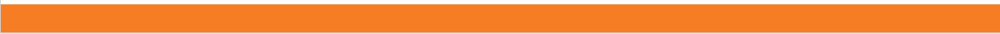{width="1000" height="10"}

# Common Questions Asked in Data Science

-   Does X **predict** Y?

-   Are there any **distinct groups** in our data?

-   What are the **key components** of our data?

-   Is one of our observations **"weird"**?

    -   <https://www.northwesternmutual.com/anti-fraud-efforts/>

{width="1000" height="10"}

# From a business perspective

Data Science can help us with use cases such as:

-   What is the *likelihood* that a customer will buy this product?

-   Is this a *good* or *bad* review?

-   *How much* demand will there be for my service tomorrow?

-   Is this the *cheapest way* to deliver my goods?

-   Is there a better way to *segment* my marketing strategies?

-   What *groups of products* are customers purchasing together?

    -   Example?!

-   Can we automate this simple yes/no decision?

    -   Credit card applications

{width="1000" height="10"}

# Artificial Intelligence vs. Machine Learning vs. Deep Learning

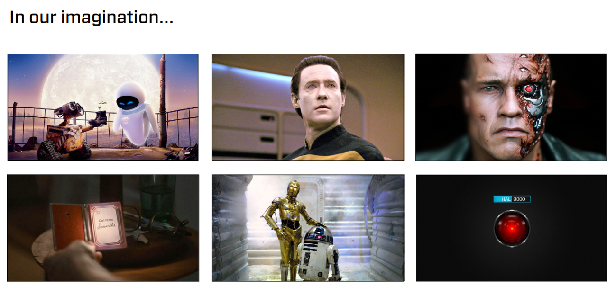

-   Artificial intelligence is an umbrella term that covers machine learning and deep learning

-   Deep learning and neural networks are also types of machine learning algorithms

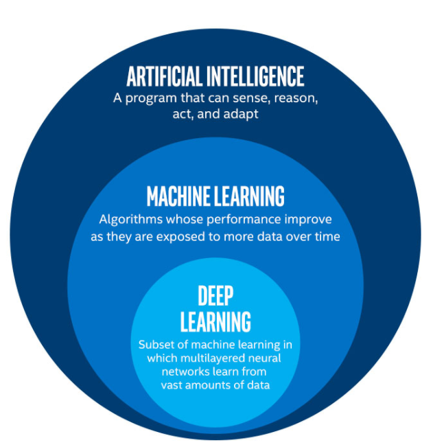

## AI is nothing new!!

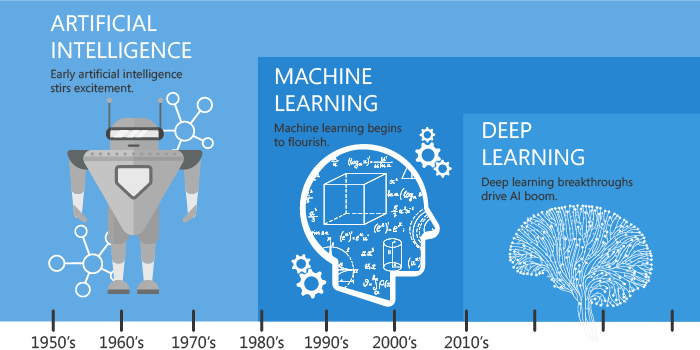

Why now?

In the last few years there has been a lot of advancements in technologies that enable AI

-   Compute Power

-   Big Data

-   Powerful Algorithms

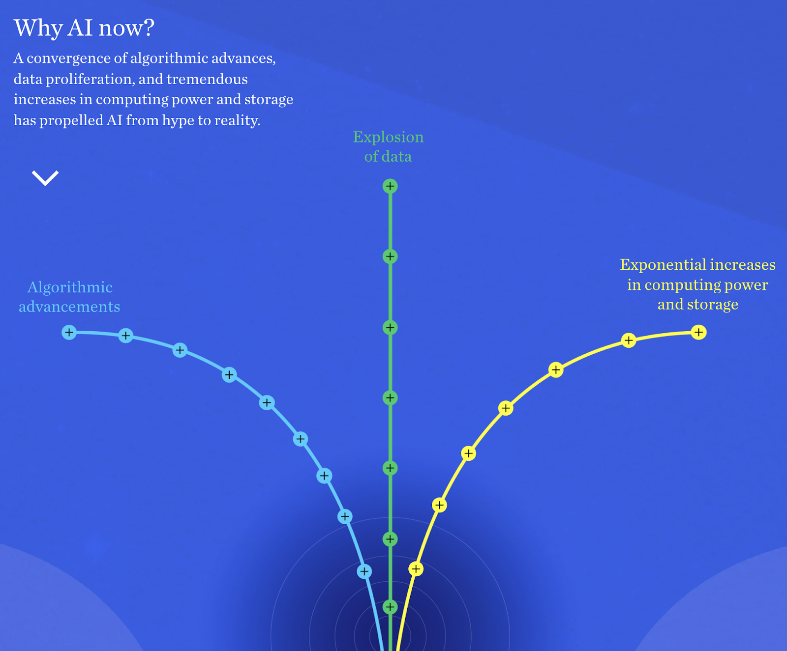

Read more here: <https://www.mckinsey.com/business-functions/mckinsey-analytics/our-insights/an-executives-guide-to-ai>

{width="1000" height="10"}

# How Big the data could be?

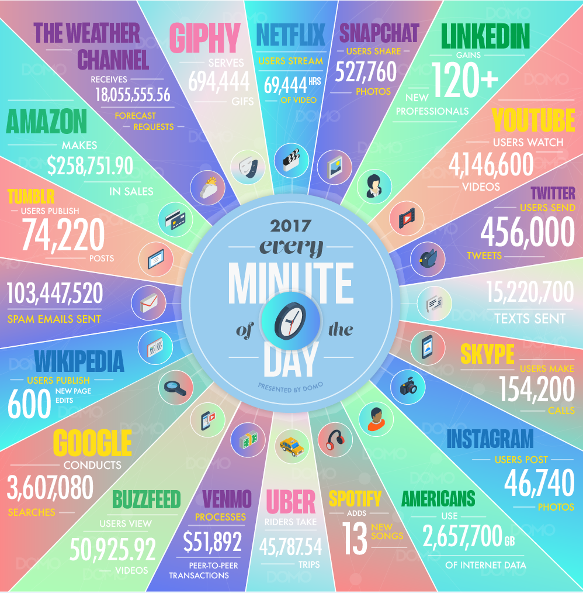

{width="1000" height="10"}

# Machine Learning Example

Given different features of a house (age, price, \#rooms), is the house located in SF or NY?

## 

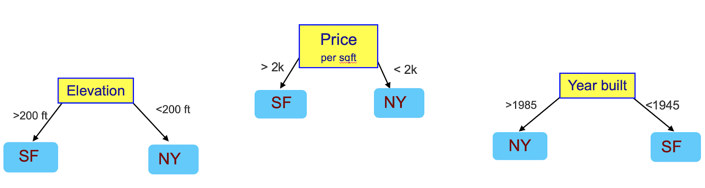

[Demo](http://www.r2d3.us/visual-intro-to-machine-learning-part-1/)

{width="1000" height="10"}

## Brain Vs. Computer


\

{width="1000" height="10"}

# The Data Science Workflow

-   **Understand the Business Problem:** Develop a hypothesis-driven approach to your analysis.

-   **Data Acquisition and Understanding:** Select, import, explore, and clean your data.

-   **Build a Model:** engineer your data, build models, evaluate them and build the best model.

-   **Deployment:** deploy your model in production and deliver ROI!


{width="1000" height="10"}

# This is what data scientists do

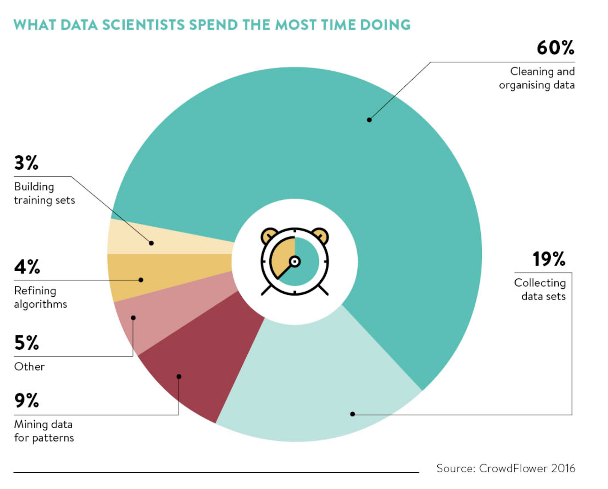

{width="1000" height="10"}

# Step 1. Business Understanding

-   Identify the business/product objectives.

-   Identify and hypothesize goals and criteria for success.

-   Create a set of questions to help you identify the correct data set.

## Use Case

We work for a real estate company interested in using data science to determine the best properties to buy and resell. Specifically, your company would like to identify the characteristics of residential houses that estimate their sale price and the cost-effectiveness of doing renovations

### Objectives

The customer tells us their business goals are to **accurately predict** prices for houses (so that they can sell them for as large a profit as possible) and to identify which **kinds of features** in the housing market would be more likely to lead to foreclosure and other abnormal sales (which could represent more profitable sales for the company).

### Identify and Hypothesize Goals and Criteria for Success

Ultimately, the customer wants us to:

-   Deliver a presentation to the real estate team.

-   Write a business report discussing results, procedures used, and rationales.

-   Build an API that provides estimated returns

### Questions to identify correct data

-   Can you think of questions that would help this customer deliver on their business goals?

-   What sort of features or columns would you want to see in the data?

-   Before going to data acquisition, you can ask questions such as

    -   What would an ideal data set look like?

    -   Describe the dataset that you think would be ideal for this use case

{width="1000" height="10"}

# Step 2. Data Acquisition

-   Ideal Data vs. Available Data

-   Oftentimes, we'll start by identifying the ideal data we would want for a project.

-   Then, during the data acquisition phase, we'll learn about the limitations on the types of data actually available.

    -   We have to decide if these limitations will inhibit our ability to answer our question of interest or if we can work with what we have to find a reasonable and reliable answer.

## Example

We provide a set of housing data for Ames, Iowa, which includes:

-   20 continuous variables indicating square footage.

-   14 discrete variables indicating number of each room type.

-   46 categorical variables containing 2--28 classes each, e.g., street type (gravel/paved) and neighborhood (city district name).

    Take a moment to look through the data description. How closely does the set match the ideal data that you envisioned?

    

-   **This is possibly the hardest step in the data science workflow**.

-   At this stage, it's common to realize that the problem you're trying to solve may not be solvable with the information available.

-   The data could be incomplete, non-existant, or unable to meet the criteria necessary to answer your question.

-   Example of Ames housing

    ```{r echo=FALSE}
    df <- read.csv("./data/AmesHousing.csv")
    new_DF <- df[rowSums(is.na(df)) > 0,]
    head(new_DF,n=15)

    ```

    {width="1000" height="10"}

## Data Wrangling & Cleaning

-   This is by far the **most time consuming step** of Data Science Lifecyle

    For the Ames housing dataset we discussed,

    -   What if the data are in different databases and we have to consolidate them?

    -   What if the values for some columns in the dataset are missing or in wrong format?

    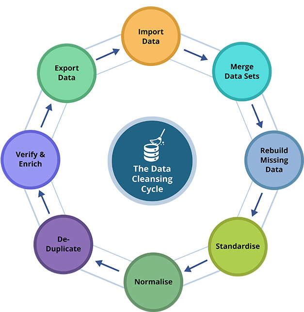

    They like coockies more than flour (Raw data)

    # 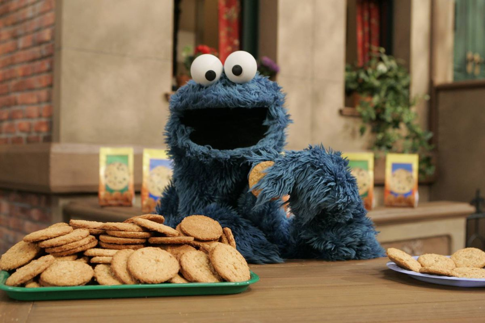

{width="1000" height="10"}

# Step 3. Modeling

What is a Model?

-   Using Machine Learning algorithms we build a model from input data (image, text, ...)

-   In case of housing data set discussed above we can build a model that learns how to predict price of a house

-   The resulting model is a representative of the data used for training

-   The size of the output model can be alot smaller than the training data

## 

Many algorithms that can be used to build a model

## 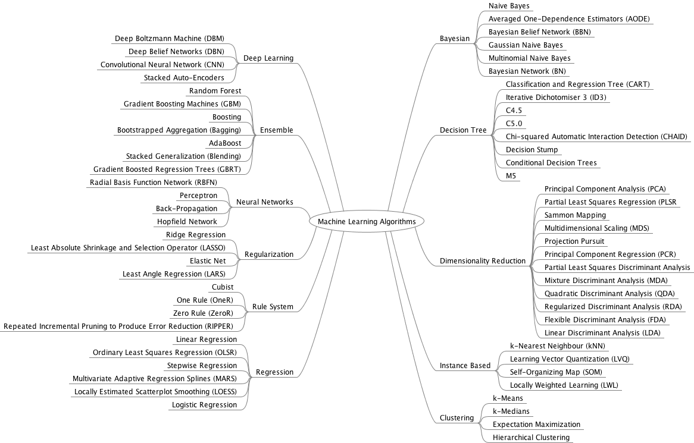

## How to choose a model?

Depending on the use case, requirements and available data, a model will be selected!

Data scientists use one of these available algorithms and tune it for their use case

-   Most these algorithms are available in public and open source libraries

-   Most data Scientists do no build their own algorithms, they just customize and tune an existing algorithm

## Example:

Given you an idea what you'll learn in this course:

```{r}
ames <- read.csv("data/AmesHousing.csv")
formula = SalePrice~ Street
lm_1 <- lm(formula,data=ames)
summary(lm_1)
```

{width="1000" height="10"}

## Supervised vs. Unsupervised Learning

There are two main categories of machine learning: supervised learning and unsupervised learning.

**Supervised learning (a.k.a., "predictive modeling"):**

-   Classification and regression

-   Predicts an outcome based on input data.

    -   Example: Predicts whether an email is spam or ham.

-   Attempts to generalize.

-   Requires past data on the element we want to predict (the target).

**Unsupervised learning:**

Clustering and dimensionality reduction

-   Extracts structure from data.

    -   Segmenting grocery store shoppers into "clusters" that exhibit similar behaviors.

-   Attempts to represent.

-   Does not require past data on the element we want to predict.


-   Oftentimes, we may combine both types of machine learning in a project to reduce the cost of data collection by learning a better representation.

-   Unsupervised learning tends to present more difficult problems because its goals are amorphous. Supervised learning has goals that are almost too clear and can lead people into the trap of optimizing metrics without considering business value.

{width="1000" height="10"}

## Feature Engineering

Machine learning algorithms need the data to be engineered before they consume it

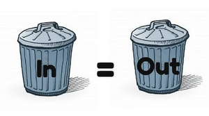

We need feature engineering to enrich the raw data

Suppose, we want to predict the customers next purchase using a dataset looking like this:

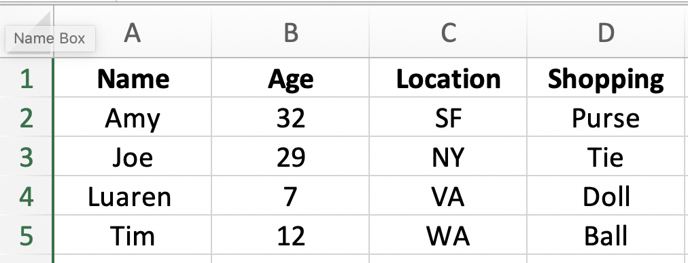

How can we enrich this data?

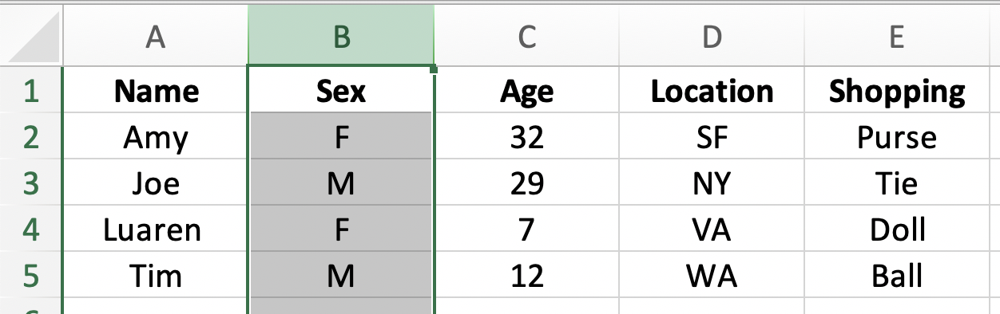

\
Now, the steps to do feature engineering are as follows:

-   Brainstorm features.

-   Create features.

-   Check how the features work with the model.

-   Start again from first until the features work perfectly.

{width="1000" height="10"}

# OverFitting and UnderFitting

\
\

-   Finding chance occurrences in data that looks like interesting patterns, but which **do not generalize**, is called **over-fitting the data**

-   We want models to apply **not just to the exact training set but to the general population** from which the training data came

    -   **Generalization**

-   Is green line a good classifier?

-   Is green line **more complex** than the black line?\
    \

-   Over-fitting is the tendency of data mining procedures to tailor models to the **training data**, at **the expense of generalization** to previously unseen data points

-   All data analytics procedures have the tendency to over-fit to some extent

-   Some more than others:

    -   "If you torture the data long enough, it will confess"

    -   There is **no** single choice or procedure that will eliminate over-fitting, recognize over-fitting, and manage complexity in a principled way!

    -   We always want to find the trend, not fit the line to all the data points.

-   We want the model to learn from the training data, but we don't want it to learn too much (i.e. too many patterns). One solution could be to stop the training earlier. However, this could lead the model to not learn enough patterns from the training data, and possibly not even capture the dominant trend. This case is called underfitting.

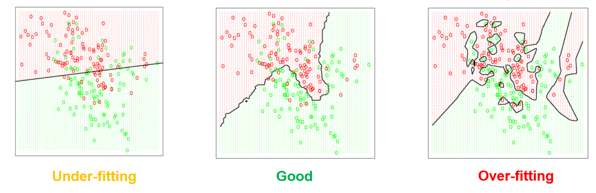\
Detecting whether the model suffers from either one is the sole responsibility of the model developer.

{width="1000" height="10"}

## Test Train Split

-   Should we use all the data for training a model?

-   Data Scientists usually keep parts of the data for testing the model performance

-   if we use all the data for training then we do not have any way of evaluating the model performance.

\
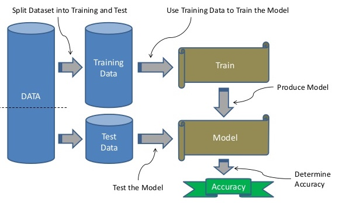

Can you think of the challenges here?

{width="1000" height="10"}

## Extra: Cross Validation

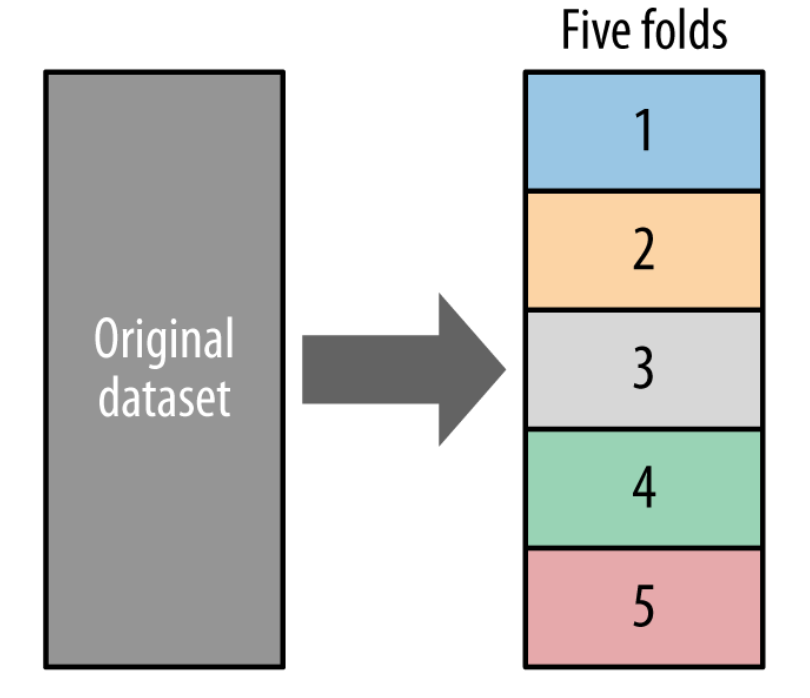\

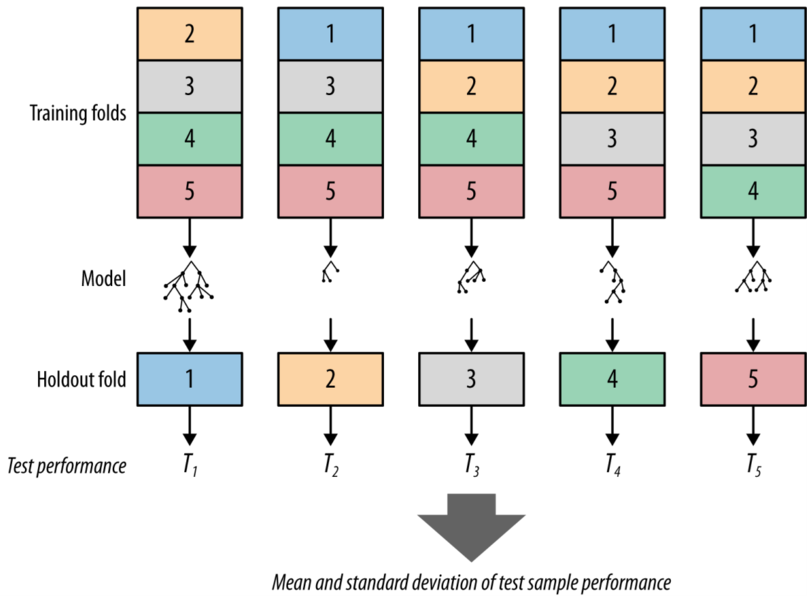

{width="1000" height="10"}

# Step 4. Use Cases

-   What are some of the use cases for AI/ML ?

-   Nearly all occupations will be affected by automation

-   But only about 5 percent of occupations could be fully automated by currently demonstrated technologies.

-   Many more occupations have portions of their constituent activities that are automatable:

    -   We find that about 30 percent of the activities in 60 percent of all occupations could be automated.

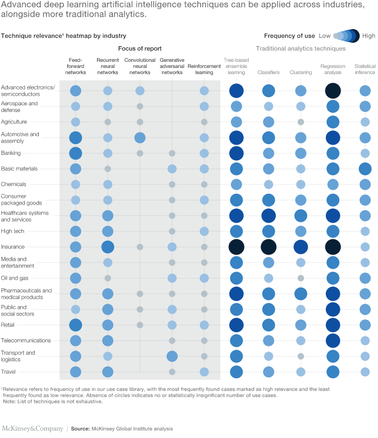

{width="1000" height="10"}

# Next Steps

-   Make sure to install the latest version

-   We will go over the R Programming language after break:

\
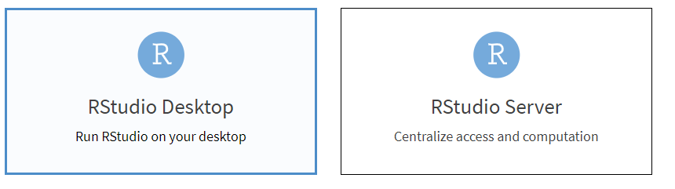

# Learning Objectives

\
In this lesson, we will go over the followings:

-   What is R and Why R? 

-   RStudio IDE

-   Basics

    -   Commands, assignments, and objects

    -   Code, data, and file organization

    -   Getting help and use help

    -   loops, if statements

-   Writing the good code

{width="1000" height="10"}

# What is R and Why R?  

-   "it consists of a language plus a run-time environment with graphics, a debugger, access to certain system functions, and the ability to run programs stored in script files " 

-   Developed in 1992 by Ross Ihaka and Robert Gentleman at the University of Auckland  

-   In top-3 programming languages for data science

    -   R was **ranked \#1** in the KDnuggets 2014 poll on Top Languages for analytics

-   Using R:

    -   New users should work with the integrated development environment (IDE) called RStudio

{width="1000" height="10"}

# The RStudio IDE

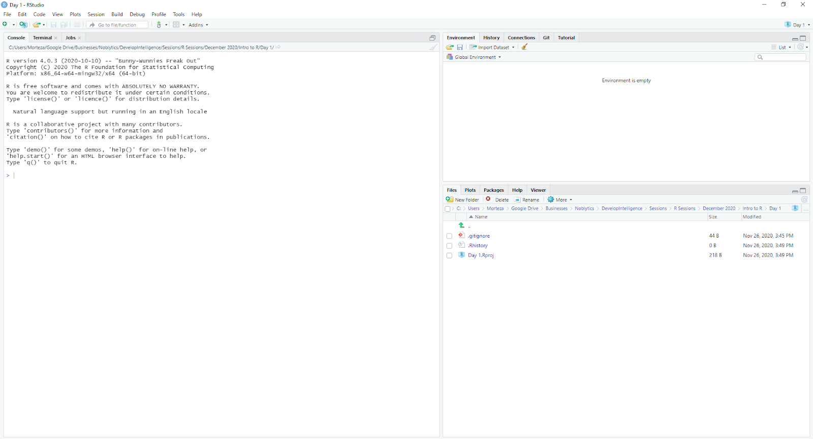 Create a New Project -- Step 1

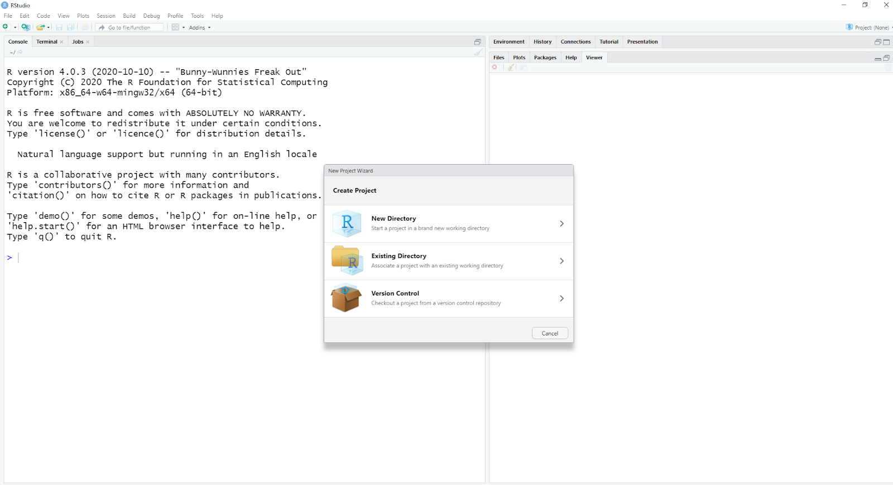

## Create a New Project -- Step 2

# 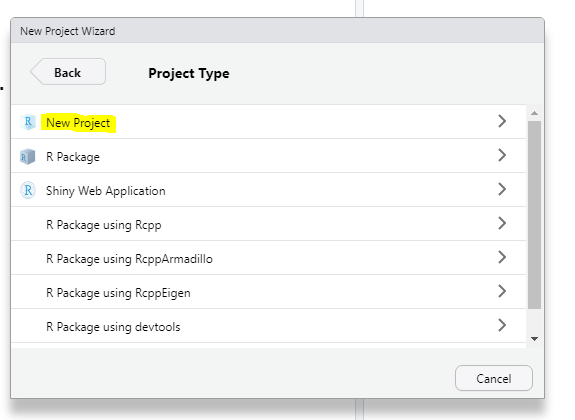

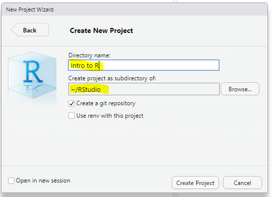

# Working with console:

The basic approach to using R interactively is to type a command and hit Enter  

```{r}
10 - 6
```

The result that R returns, 4, has as [1] at the left side of the line. This number simply indicates the position of the adjacent element in the output{this will make more sense later when the output has more elements

-   Multi-line commands, an R console will display a "continuation symbol" +  

```{r}
 10 - 
+ 6

```

hit Enter before typing the 6 

The continuation character indicates that R is waiting for something  

To see what is contained within a symbolic variable, type its name  

```{r}
x <- 10
x
```

-   Recall a previous command in an R console by hitting the up arrow on your keyboard

-   When you give R an assignment, such as the one above, the object referred to as x is stored in your workspace

    -   ls(): list all the objects in the your workspace

    -   rm(x): remove the object from your workspace

    -   rm (list=ls()) : what does this do? 

-   **R is a case-sensitive language**

-   If you are stuck in a bad command in the console, just hit the **Esc**

# The RStudio IDE  with script editor

\


## RStudio

-   It is now much more than a script editor, and includes tools for building packages and writing dynamic reports, among others 

-   The lower left window is the console by default  

-   You can click within it and interact directly with R  

-   If your code is worth writing, it is probably worth saving

-   Don't write it in the console, write it in a R script file.

-   You can then repeat the same analysis in the future

{width="1000" height="10"}

**Comments**: create a comment with the comment character \#  

```{r}
# Notes from Day 1 of Intro to R
# M. Zihayat
# you can use ctrl+shift+C to comment a line
```

**Working directory:** Tells R where to look for files that are to be read in, and where to write files.

-   When you create a project, it is set to your project folder by default

Two ways to set it:

-   Session menu

-   Commands:

    ```{r}
    getwd() #tells you the current directory
    #setwd('C:/Users/Morteza/Documents/RStudio/Intro to R - Day 1')#set the current directory
    ```

    ## Run a script in RStudio

    **CTRL + Enter** Run current line or selection 

    **CTRL + Shift + Enter** Run all lines

{width="1000" height="10"}

## Commands, assignment, and objects  

-   The R language is a mix of functional and object-oriented style  

-   Most (technically all) of the operations carried out in R are done by calling up functions, e.g., sqrt(10) will calculate the square root of 10  

-   The variables you create and work with in R are called **objects**  

-   Objects are really anything that can be assigned to a symbolic variable; data structures (e.g., a matrix) and functions (e.g., sqrt) are examples of objects  

-   Many functions in R operate differently on different types of objects  

{width="1000" height="10"}

## Operators

```{r}
10^3.5 + 87*3.2 - 1000/18
```

## Relational operators: ==, !=, \<, \>, \<=, \>= 

```{r}
a <- 50
a >= 100
```

## Default Functions

-   The central computation in R is a function call  

-   Functions require arguments, which are the objects that the function should act upon and other instructions for the function

```{r}
sqrt(10)
```

you can bring up the help page for any function by typing ? followed by the function name

    ?sqrt

## Mathematical functions

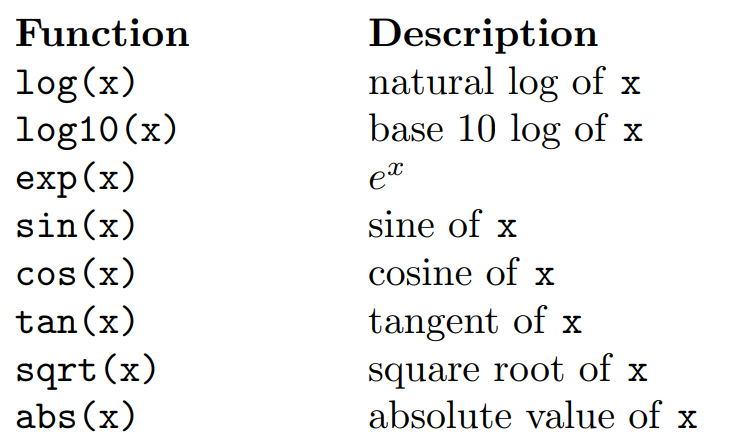

```{r}
x <- pi/2 + 0.2
a <- sin(x)
b <- round(a, 2)

```

Or

```{r}
 round(sin(pi/2 + 0.2), 2) 
```

Generic functions

The functions with general name while their functionality changes with respect to the input parameters.

```{r}
 plot(1:10)
```

```{r}
plot(sin)
```

see all the functionalities:

```{r}
methods(plot)

```

{width="1000" height="10"}

## **Common R Functions and Control Flow**


**`if… else` Statements**\

    if (test_expression) {
    statement1
    } else {
    statement2
    }

```{r}
if (50 < 30){
    print("50 < 30.")
}else{
    print("50 >= 30.")
    print("The else code block was run instead of the first block.")
} 

print('---')
print('These two lines are not indented, so they are always run next.')
```

```{r}
# create two random variables
#if the first one is bigger, add 10 to the variable 
#print it is bigger with 10 extra point
#else print the second one is bigger
```

## **`for` Loops**

-   One of the primary purposes of using a programming language is to automate repetitive tasks. One example is the `for` loop.

-   The `for` loop allows you to perform a task repeatedly on every element within an object, such as every name in a list.


Let's say we wanted to print each of the names in the list, as well as "is Awesome!" In this case, we'd create a temporary variable for each element in the collection (`for name in names` would put each name, in sequence, under the temporary variable `name`) and then do something with it.

```{r}
names <- c('Rebecca Bunch', 'Paula Proctor', 'Heather Davis')

for (val in names) {
  cat(val,"is Awesome \n")  
}

#write down a loop that takes a list and multiply each element by
#10 and print its square root.

#if the sqrt of the val is more than 8, print "this is exciting"
#if not, print "too low to be true"
```

{width="1000" height="10"}

# Working with add-on packages  

-   While the base packages include many useful functions, for specialized procedures you may need content from add-on packages.

-   CRAN website <http://cran.r-project.org/> currently lists more than 4000 add-on packages 

        install.packages("dplyr")

load a package

``` {.{.{.{.{.{.{.{.{.{library(\\\\\\\\\\\\\\\\\\\\\\\\\\\\\\\\\\\\\\\\\\\\\\\\\\\\\\\\\\\\\\\\\\\\\\\\\\\\\\\\\\\\\\\\\\\\\\\\\\\\\\\\\\\\\\\\\\\\\\\\\\\\\\\\\\\\\\\\\\\\\\\\\\\\\\\\\\\\\\\\\\\\\\\\\\\\\\\\\\\\\\\\\\\\\\\\\\\\\\\\\\\\\\\\\\\\\\\\\\\\\\\\\\\\\\\\\\\\\\\\\\\\\\\\\\\\\\\\\\\\\\\\\\\\\\\\\\\\\\\\\\\\\\\\\\\\\\\\\\\\\\\\\\\\\\\\\\\\\\\\\\\\\\\\\\\\\\\\\\\\\\\\\\\\\\\\\\\\\\\\\\\\\\\\\\\\\\\\\\\\\\\\\\\\\\\\\\\\\\\\\\\\\\\\\\\\\\\\\\\\\\\\\\\\\\\\\\\\\\\\\\\\\\\\\\\\\\\\\\\\\\\\\\\\\\\\\\\\\\\\\\\\\\\\\\\\\\\\\\\\\\\\\\\\\\\"dplyr\\\\\\\\\\\\\\\\\\\\\\\\\\\\\\\\\\\\\\\\\\\\\\\\\\\\\\\\\\\\\\\\\\\\\\\\\\\\\\\\\\\\\\\\\\\\\\\\\\\\\\\\\\\\\\\\\\\\\\\\\\\\\\\\\\\\\\\\\\\\\\\\\\\\\\\\\\\\\\\\\\\\\\\\\\\\\\\\\\\\\\\\\\\\\\\\\\\\\\\\\\\\\\\\\\\\\\\\\\\\\\\\\\\\\\\\\\\\\\\\\\\\\\\\\\\\\\\\\\\\\\\\\\\\\\\\\\\\\\\\\\\\\\\\\\\\\\\\\\\\\\\\\\\\\\\\\\\\\\\\\\\\\\\\\\\\\\\\\\\\\\\\\\\\\\\\\\\\\\\\\\\\\\\\\\\\\\\\\\\\\\\\\\\\\\\\\\\\\\\\\\\\\\\\\\\\\\\\\\\\\\\\\\\\\\\\\\\\\\\\\\\\\\\\\\\\\\\\\\\\\\\\\\\\\\\\\\\\\\\\\\\\\\\\\\\\\\\\\\\\\\\\\\\\\\\")}}}}}}}}}}
library(dplyr)
```

## The tidyverse packages

-   One of the most important of these is dplyr, which is designed for data manipulation

-   The dplyr package and 11 others that share some approaches to programming are collectively referred to as the tidyverse, or tidyverse packages\
    The most important of these packages are:\
    • **dplyr**, for data manipulation\
    • **magrittr**, which defines the forward pipe operator\
    • **ggplot2**, which can be used to make sophisticated plots without much effort\
    • **lubridate**, for working with dates and times\
    • **tibble**, which defines a new type of data frame\
    • **readr**, for reading in data from text files\
    • **readxl**, for reading data from Excel files\
    • **tidyr**, for reshaping data frames to make "tidy" data

-   These packages are great

-   the syntax of these packages is not completely consistent with base R

-   the functions are not always consistent with other functions

        install.packages("tidyverse")

    ``` {.{.{.{.{.{.{.{.{.{library(tidyverse)}}}}}}}}}}
    library(tidyverse)
    ```

    {width="1000" height="10"}

    ## Writing good code  

-   Good codes bring reusability:

    -   Include comments in your scripts

    -   Use spaces between object names, operators, and constants

    -   Indent code in order to see clearly what belongs where

    -   Stick with lowercase object and column names

    -   Use blank lines to separate blocks of code

    ## 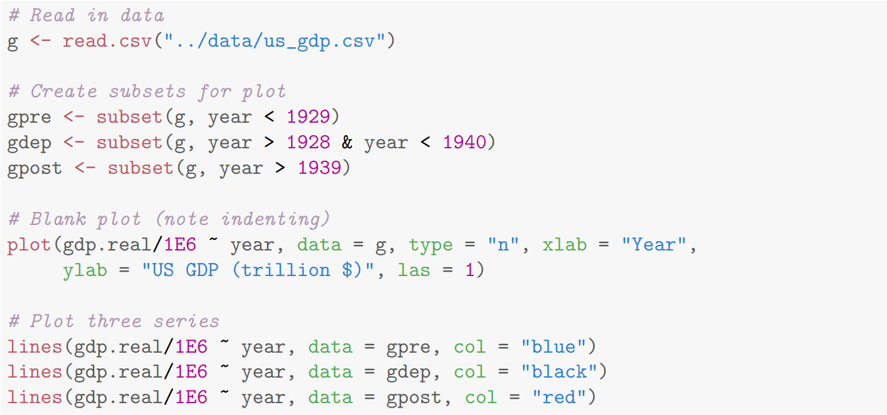

    Data organization  

    1\. Header rows are only present at the top of the file

    2\. Each column contains a single variable

    3\. Each row contains a single observation

    4\. Each file (or worksheet) contains a single block of data

    ## 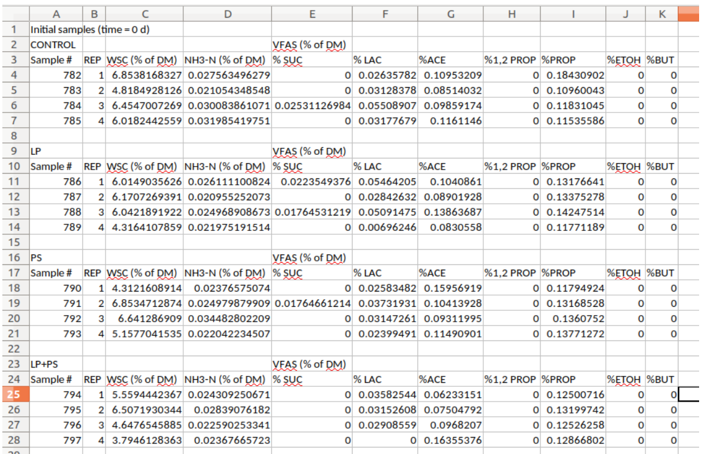

    File organization and workflow  

-   It is very easy to make a mess of file organization  

-   We want to get to an answer quickly  

-   Each project, should have a separate folder containing all project files  

-   One suggestion: 

    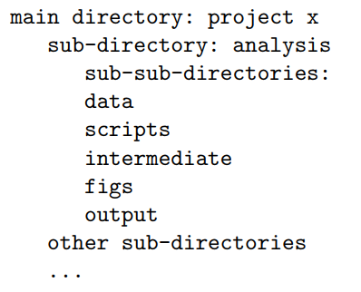

-   The "scripts" directory contains all R scripts 

-   "figs" and "output" contain graphical and other output.

-   The "intermediate" directory is used for intermediate data sets that need to be saved. 

-   Automate every step:

    -   Try to avoid any data processing in Excel  

    ```{r}
    #create a project for Day 2. 
    # Build the same structure as I suggested
    # Move the data files in "Intro-to-R" to the data folder
    # Create a script file named Part1.r
    ```

## Getting help  

-   CRAN website (<http://cran.r-project.org/manuals.html>  

-   Frequently Asked Questions on CRAN (<http://cran.r-project.>org/faqs.html) answers a lot of basic questions  

-   R site search" ([http://finzi.psych.upenn.edu/search.html)](http://finzi.psych.upenn.edu/search.html))  

-   Mailing lists:

    -   You can sign up for any of the lists here: <http://www.r-project.org/mail.html.> Before posting a question, be sure to search the mailing list archives, and check the posting guide (<http://www.r-project.org/posting-guide>.html).
